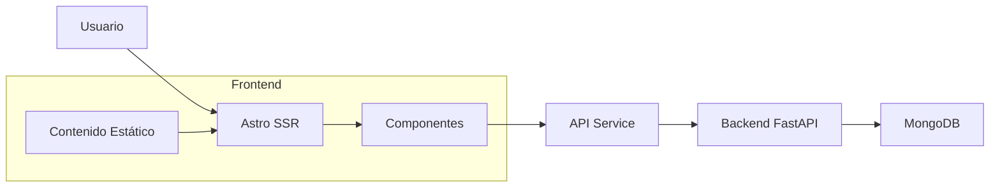

## Patrón de Diseño

El proyecto utiliza la arquitectura **Islands** de Astro con SSR:

```text
Frontend (Astro SSR)
├── Server-Side Rendering
├── Static Site Generation (para contenido)
├── Interactive Islands (componentes dinámicos)
└── API Integration (Backend FastAPI)
```

## Características Técnicas

- **SSR (Server-Side Rendering)** con Astro
- **Adaptador Node.js** en modo standalone
- **Generación de contenido** desde colecciones Markdown
- **Componentes interactivos** con vanilla JavaScript
- **Mapas interactivos** con Leaflet
- **Diseño responsivo** con CSS personalizado
- **Integración API REST** con backend FastAPI
- **Middleware** para autenticación

## Flujo de Datos



```text
Renderizado Híbrido (SSR + CSR)
```
